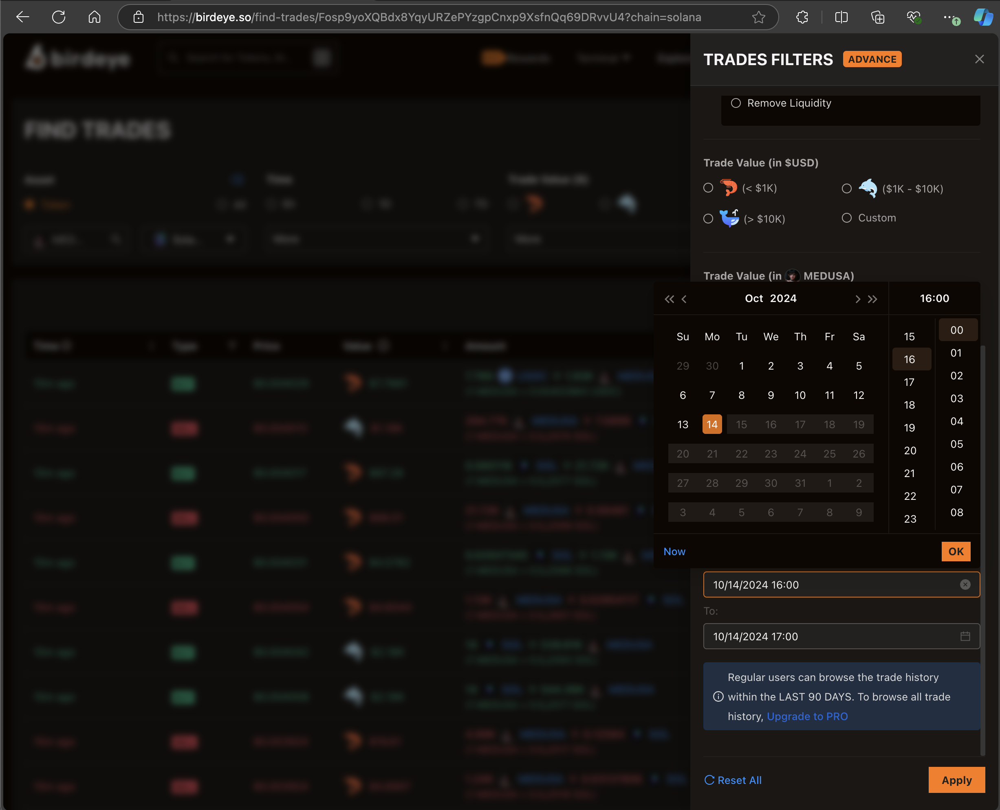
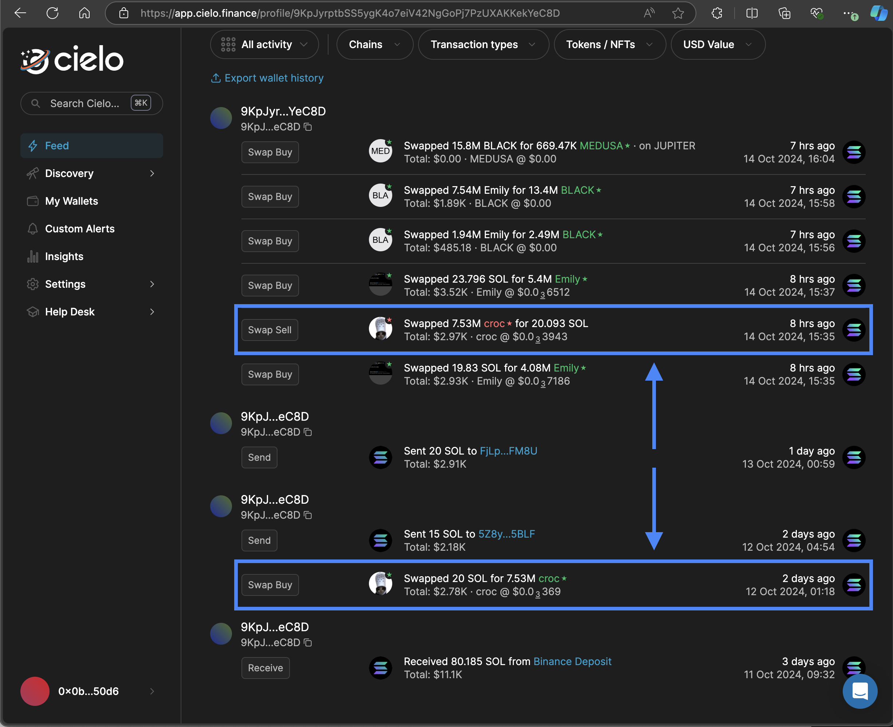

# solana_trader

To install dependencies:

```bash
bun install
```

To run:

```bash
npm run dev
```

## What is this project about?

This project is a simple trading bot that uses a combination of the [Jupiter API](https://station.jup.ag/docs/apis/), [Cielo Wallet Tracker](https://app.cielo.finance/), [Telegram](https://telegram.org/), and the [Solana blockchain](https://solana.com/) to copy trades from insider wallets to your own wallet.

## How does it work?

### Telegram setup

Why do we need Telegram? Telegram is a messaging app that allows you to send messages and media to other users. We will use Telegram to send alerts to our bot, which will then execute trades on our behalf.

- First you need to create a [Telegram account](https://telegram.org/)
- Next you need to create a [Telegram app](https://core.telegram.org/api/obtaining_api_id) and get your API ID and API hash

You're done for now

### Solana Wallet setup

Why do we need a Solana Wallet? A Solana Wallet is a digital wallet that allows you to store, send, and receive Solana tokens. We will use a Solana Wallet to store the tokens we buy and sell.

It also allows us to connect to the Solana blockchain and execute trades.
It is basically a keypair that allows you to sign transactions on the Solana blockchain as well as an address that identifies your wallet.

- First you need to create a Solana Wallet (you can use [Phantom](https://phantom.app/) or [Sollet](https://www.sollet.io/))
- Next you need to get your Solana Wallet address and private key
  - Your Solana Wallet address is a string of characters that identifies your wallet
  - Your Solana Wallet private key is a string of characters that allows you to sign transactions on the Solana blockchain as well as access your wallet. It is important to keep your private key safe and secure.
- Fund your Solana Wallet with SOL tokens
  - You need SOL tokens to pay for transaction fees on the Solana blockchain
  - You can buy SOL tokens on [FTX](https://ftx.com/), [Binance](https://www.binance.com/), or [Coinbase](https://www.coinbase.com/) and send them to your Solana Wallet address
- Get a Solana Wallet RPC URL
  - A Solana Wallet RPC URL is a string of characters that allows you to connect to the Solana blockchain
  - You can use the [Solana Explorer](https://explorer.solana.com/) to get a Solana Wallet RPC URL

You're done for now

### Cielo Wallet Tracker setup

Why do we need Cielo Wallet Tracker? Cielo Wallet Tracker is a tool that allows you to track the wallets of top traders on the Solana blockchain. We will use Cielo Wallet Tracker to copy trades from insider wallets to our own wallet.

- First you need to create a [Cielo account](https://app.cielo.finance/)
- Next you need to connect your Cielo account to your Solana wallet
- Set up a Cielo Telegram alert and link it to your Telegram account

Later, we'll come back to add insider wallets but for now, you're done for now

## How to use this project?

### Step 1: Clone the repository

```bash
git clone https://github.com/ovieokeh/solana_trader.git
```

### Step 2: Install dependencies

```bash
bun install
```

or

```bash
npm install
```

### Step 3: Set up your environment variables

Create a `.env` file in the root directory of the project and copy the contents of the `.env.example` file into it. Replace the placeholder values with your own values.

You should have all the values you need from the previous steps.

Note: You should never commit your `.env` file to version control.

### Step 4: Add insider wallets

This is the most important step but also a bit tedious. You basically need to find
the wallets of traders who consistently get in to shitcoins early, get out at the right time, and make a lot of money.

You can source these wallets from Twitter, Telegram, or other social media platforms.

The method I'm using is as follows

- Go to [BirdEye.so](https://birdeye.so/) and look for trending tokens with good volume and a disgusting price increase in the last hour.



- Once you find a token, view the trades of the token and filter by date/time to see the first trades.


- Go through wallets with manual looking prices and go back to [Cielo Wallet Tracker](https://app.cielo.finance/) to see the trades of the wallet.



In the example above,

- The wallet bought 7.53M `croc *` at 12 Oct, 01:18 at the price of `$0.03369` per `croc *`
- The wallet sold 7.53M `croc *` at 14 Oct, 15:35 at the price of `$0.03943` per `croc *`
- The wallet made a profit of approximately `$43,000` in 2 days and 14 hours

If you see a wallet consistently making trades like this, add it to your Cielo tracker.

- If the wallet has a good history of getting in early and getting out at the right time, add it to your Cielo tracker (Make sure the tracker is active and linked to your Telegram account)

Tip:
Look at the activity history, the price at which they bought the token, the price at which they sold the token, and the time it took them to make the trade. If they consistently make good trades, add them to your Cielo tracker.

This is a bit tedious but it's worth it in the long run. You only need a few wallets to make a lot of money. The only downside is that insiders tend to change wallets frequently so you need to keep an eye on them.

### Step 5: Run the project

```bash
npm run dev
```

The first time you run the project, you will be prompted to log in to your Telegram account. Follow the instructions in the terminal to log in.

You should see logs in the terminal showing what the bot is doing.

You know the bot is ready when you see the following log:

```bash
>> [coin-analysis.ts] no tracked coins. sleeping...
```

You can configure some settings in the `lib/config/general.ts` file.

- TRADE_AMOUNT_IN_SOL: The amount of SOL tokens you want to trade
- TRADE_SLIPPAGE_BPS: The slippage in basis points you are willing to accept
- STOP_LOSS_PERCENTAGE: The percentage at which you want to stop loss
- FIRST_TAKE_PROFIT_PERCENTAGE: The percentage at which you want to take profit for the first time
- SECOND_TAKE_PROFIT_PERCENTAGE: The percentage at which you want to take profit for the second time

Note:
By default, the bot makes the following trades:

- Buys a token
- Batches the following trades
  - Sets a stop loss
  - Sets a first take profit
  - Sets a second take profit
- Confirms the transactions

You can not easily modify this behavior for now unless you're willing to dive into the code.

## Next steps

As long as

- Your Solana wallet is well funded
- You have insider wallets that consistently make good trades
- Your Cielo tracker is active and linked to your Telegram account
- This program is running and connected to your Telegram account

You should be able to copy trades from insider wallets to your own wallet and theoritically make a lot of money.

## Disclaimer

This project is for educational purposes only. I am not responsible for any losses you may incur while using this project. Please do your own research before making any trades.

## License

This project is licensed under the MIT License - see the [LICENSE](LICENSE) file for details.
